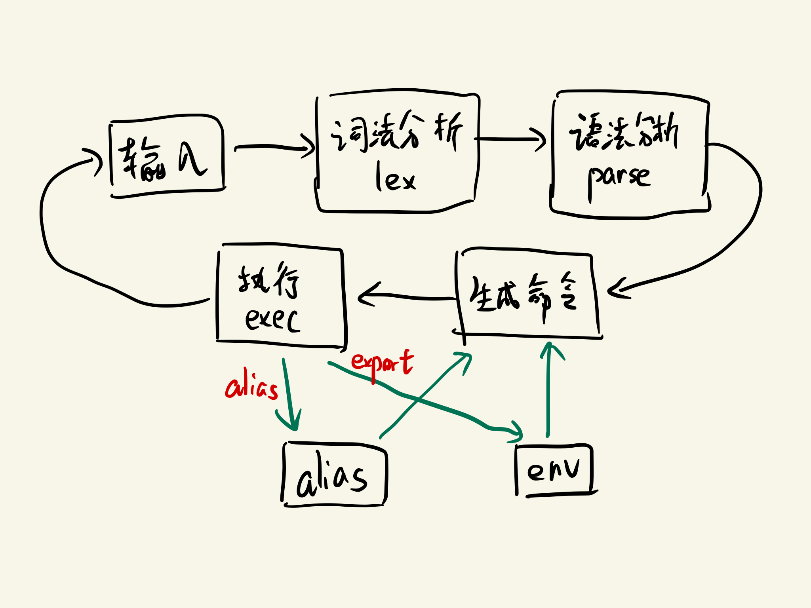
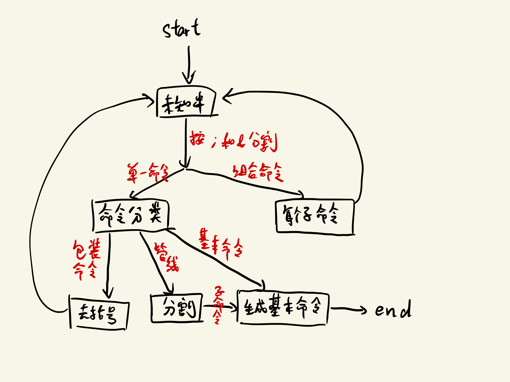

# Lab2 Shell

## 设计目标

本 shell 设计支持以下功能和命令格式：

- **内置命令** `cd`, `alias`, `export`, `exit`, 如
  - `alias`（查看所有设置的 alias）
  - `alias l='ls -alh --color=tty'`（设置 alias）
  - `alias l`（查看 `l` 的 alias）
  - `cd /dev/shm`
  - `cd $HOME`
  - `export`（查看所有环境变量）
  - `export A=1 B=2`（设置环境变量）
  - `exit`
  - `exit 2` (exitcode=2)


- `> file`, `m > file`, `>> file`, `m >> file`, `< file`, `m < file`, `>& n`, `m >& n`, `<& n`, `m <& n` 这些**重定向修饰**语句的任意排列

- 命令前的**环境变量传递**，如
  - `https_proxy='socks5://127.0.0.1:1080' pacman -Syyu`

- **基本命令** `[envname=[env]]* cmd [args]* [io_modifier]* [&]`, 例如
  - `ls -alh --color==tty`
  - `pwd &`
  - `export A=1`
  - `ARCH=aarch64 make > output 2>&1`

- 任意**非后台运行**的基本命令通过管线 `|` 组合出的**管线命令**，管线命令也可在最后添加 `&` 成为后台命令，如
  - `ls | cat | wc`
  - `gcc 2>&1 | wc`
  - `echo 233 | wc &`

- 基本命令和管线命令通过 `&`, `;` 组合而成的**组合命令**，如
  - `ls | cat | wc & gcc --version`
  - `sleep 1; echo aha; sleep 1`

- 基本命令、管线命令或组合命令通过 `(cmd) [&]` **包装**而成的命令，包装而成命令类型与被包装的命令一致，如
  - `(sleep 1; echo aha) &`
  - `(ls|cat|wc)&`
  - `(env)`

- **引号** `'`(不进行变量解析) 和 `"`(进行**变量解析**)

- 非单引号 `'` 括起的字段都会解析并替换其中 `$` 开头的环境变量，如
  - `echo $PATH`
  - `echo "$PATH"`
  - `echo '$PATH'`
  - `echo PATH=$PATH`

## 实现方法

程序总体的运行流程如下：

<div align="center">

</div>

任何阶段出现异常都会抛出错误信息。

### 输入

通过 `radline` 库的 `readline(char *hint)` 函数实现可移动光标的输入模式。

hint 通过读取 username 和 hostname 生成，如

```shell
[monsoon@Monsoon-PC]$
```

### 词法分析

**词法分析函数 `lex` 把一条命令拆成一个个用于语法分析的基本字段**。

本 shell 支持的关键字有 `>`, `>>`, `<`, `>&`, `<&`, `|`, `;`, `&`, `(`, `)`.

关键字与非关键字之间可以有分隔符（包括空格, `\n`, `\r`, `\t`, `\f`, `\v`），也可以没有，例如

```shell
ls 2>file
ls 2 > file
```

都是合法的。

词法分析为**状态机实现**，共有 `in_splitter`, `in_key`, `in_word`, `in_quota` 4 种状体，转化图较为复杂，此处略去不表。

具体实现代码见 `lex.cpp`

### 语法分析

**语法分析函数 `parse` 从基本字段串中解析出三种类型的命令**，结构如下：

<div align="center">

</div>

### 生成命令

#### 1. 基本命令

生成基本命令有如下几步：

1. 寻找所有命令前的变量设置，如 `A=1`, `B=2` 等

2. 第一个非变量设置的字段作为可执行命令，并查看 `alias`, 如果存在别名，则做替换

3. 找到所有输入输出重定向关键词，并把关键词前和命令后的字段作为参数

4. 解析所有输出输出重定向的含义

5. 解析后台运行符号 `&`

具体代码见 `basic_command.cpp`.

#### 2. 管线命令

管线命令的每个子命令都只能是基本命令，且不能是后台运行的，否则会抛出错误。

生成管线命令时，只需要把每个生成的子命令加入一个列表即可。

#### 3. 组合命令

只需把每个生成的子命令加入列表即可。

### 执行

#### 1. 基本命令

基本命令的运行流程如下：

1. **去引号，解析非关键词中的变量**

2. 调用 `fork` 生成子进程

3. 应用所有的输入输出重定向（见 `io_mod.cpp`），主要使用 `open`, `close`, `dup2` 等系统调用

4. 如果存在临时变量传递，则读取环境变量再加入临时变量，用 `execvpe` 执行；否则直接使用 `execvp` 执行。

5. 如果是后台命令，直接返回，否则使用 `wait` 等待子进程结束

具体代码见 `basic_command.cpp`.

#### 2. 管线命令

通过 `pipe` 系统调用搭建管道，每一个子命令 `fork` 一个子进程，用于执行。

具体见 `pipe_command.cpp`

#### 3. 组合命令

通过循环顺序执行每个子命令。

见 `group_command.cpp`

#### 4. 内建命令

内建命令包括 `cd`, `alias`, `export`, `exit`。

此处用到了 `chdir`, `getenv`, `setenv`, `exit` 等函数，具体实现无需多言，见 `builtin.cpp`.

## 编译与运行

编译需要链接 `readline` 库，编译器需要支持 `C++17` 标准，在确保满足条件的情况下，在 `file` 目录下运行

```shell
make
```

完成编译，运行

```shell
make run
```

开始运行。

## 测试

测试如下：

```shell
[monsoon@Monsoon-PC]$ alias l='ls -alh --color=auto'  # 测试 alias
[monsoon@Monsoon-PC]$ alias
l='ls -alh --color=auto'
[monsoon@Monsoon-PC]$ l
total 336K
drwxrwxrwt 1 root    root     512 May 29 14:05 .
drwxr-xr-x 1 root    root     512 May 26 21:30 ..
-rwxrwxrwx 1 monsoon monsoon 232K May 29 14:05 shell
[monsoon@Monsoon-PC]$ l > ls.output
[monsoon@Monsoon-PC]$ cat ls.output
total 336K
drwxrwxrwt 1 root    root     512 May 29 14:05 .
drwxr-xr-x 1 root    root     512 May 26 21:30 ..
-rw-rw-rw- 1 monsoon monsoon    0 May 29 14:05 ls.output
-rwxrwxrwx 1 monsoon monsoon 232K May 29 14:05 shell
[monsoon@Monsoon-PC]$ gcc
gcc: fatal error: no input files
compilation terminated.
[monsoon@Monsoon-PC]$ gcc 2> gcc.err  # 测试输出重定向
[monsoon@Monsoon-PC]$ cat gcc.err
gcc: fatal error: no input files
compilation terminated.
[monsoon@Monsoon-PC]$ gcc > gcc.output 2>&1  # 测试合并输出
[monsoon@Monsoon-PC]$ cat gcc.output
gcc: fatal error: no input files
compilation terminated.
[monsoon@Monsoon-PC]$ wc < gcc.err   # 测试输入重定向
 2  8 57
[monsoon@Monsoon-PC]$ l > l.output
[monsoon@Monsoon-PC]$ cat l.output
total 336K
drwxrwxrwt 1 root    root     512 May 29 14:06 .
drwxr-xr-x 1 root    root     512 May 26 21:30 ..
-rw-rw-rw- 1 monsoon monsoon   57 May 29 14:06 gcc.err
-rw-rw-rw- 1 monsoon monsoon   57 May 29 14:06 gcc.output
-rw-rw-rw- 1 monsoon monsoon    0 May 29 14:06 l.output
-rw-rw-rw- 1 monsoon monsoon  220 May 29 14:05 ls.output
-rwxrwxrwx 1 monsoon monsoon 232K May 29 14:05 shell
[monsoon@Monsoon-PC]$ l >> l.output   # 测试 append
[monsoon@Monsoon-PC]$ cat l.output
total 336K
drwxrwxrwt 1 root    root     512 May 29 14:06 .
drwxr-xr-x 1 root    root     512 May 26 21:30 ..
-rw-rw-rw- 1 monsoon monsoon   57 May 29 14:06 gcc.err
-rw-rw-rw- 1 monsoon monsoon   57 May 29 14:06 gcc.output
-rw-rw-rw- 1 monsoon monsoon    0 May 29 14:06 l.output
-rw-rw-rw- 1 monsoon monsoon  220 May 29 14:05 ls.output
-rwxrwxrwx 1 monsoon monsoon 232K May 29 14:05 shell
total 336K
drwxrwxrwt 1 root    root     512 May 29 14:06 .
drwxr-xr-x 1 root    root     512 May 26 21:30 ..
-rw-rw-rw- 1 monsoon monsoon   57 May 29 14:06 gcc.err
-rw-rw-rw- 1 monsoon monsoon   57 May 29 14:06 gcc.output
-rw-rw-rw- 1 monsoon monsoon  389 May 29 14:06 l.output
-rw-rw-rw- 1 monsoon monsoon  220 May 29 14:05 ls.output
-rwxrwxrwx 1 monsoon monsoon 232K May 29 14:05 shell
[monsoon@Monsoon-PC]$ (sleep 1;echo aha)&   # 测试后台运行
[monsoon@Monsoon-PC]$ aha    # 此处为后台命令延迟输出，真正的命令在下一行
cd /
[monsoon@Monsoon-PC]$ pwd
/
[monsoon@Monsoon-PC]$ ls
bin   dev  home  lib    lib64  mnt  proc  run   snap  sys  usr
boot  etc  init  lib32  media  opt  root  sbin  srv   tmp  var
[monsoon@Monsoon-PC]$ ls|cat  # 测试管线
bin
boot
dev
etc
home
init
lib
lib32
lib64
media
mnt
opt
proc
root
run
sbin
snap
srv
sys
tmp
usr
var
[monsoon@Monsoon-PC]$ ls|cat|wc
     22      22     101
[monsoon@Monsoon-PC]$ env
HOSTTYPE=x86_64
LANG=C.UTF-8
PATH=/usr/local/sbin:/usr/local/bin:/usr/sbin:/usr/bin:/sbin:/bin:/usr/games:/usr/local/games:/mnt/d/Program Files (Portable)/cmder_mini/vendor/conemu-maximus5/ConEmu/Scripts:/mnt/d/Program Files (Portable)/cmder_mini/vendor/conemu-maximus5:/mnt/d/Program Files (Portable)/cmder_mini/vendor/conemu-maximus5/ConEmu:/mnt/c/Program Files/Python37/Scripts/:/mnt/c/Program Files/Python37/:/mnt/c/Program Files (x86)/Intel/iCLS Client/:/mnt/c/Windows/system32:/mnt/c/Windows:/mnt/c/Windows/System32/Wbem:/mnt/c/Windows/System32/WindowsPowerShell/v1.0/:/mnt/c/Program Files/Java/jdk-12/bin:/mnt/c/WINDOWS/system32:/mnt/c/WINDOWS:/mnt/c/WINDOWS/System32/Wbem:/mnt/c/WINDOWS/System32/WindowsPowerShell/v1.0/:/mnt/c/WINDOWS/System32/OpenSSH/:/mnt/d/Android/Sdk/platform-tools:/mnt/c/Program Files/Microsoft VS Code/bin:/mnt/c/Program Files/mingw-w64/x86_64-8.1.0-release-win32-seh-rt_v6-rev0/bin:/mnt/c/Windows/System32/OpenSSH/:/mnt/d/Program Files (Portable)/graphviz-2.38/bin:/mnt/c/Program Files/Intel/WiFi/bin/:/mnt/c/Program Files/Common Files/Intel/WirelessCommon/:/mnt/c/Program Files (x86)/Intel/Intel(R) Management Engine Components/DAL:/mnt/c/Program Files/Intel/Intel(R) Management Engine Components/DAL:/mnt/c/Program Files (x86)/Intel/Intel(R) Management Engine Components/IPT:/mnt/c/Program Files/Intel/Intel(R) Management Engine Components/IPT::/mnt/d/MATLAB/R2018b/bin:/mnt/d/Program Files (Portable)/hyper:/mnt/c/Program Files/Git/cmd:/mnt/d/Program Files (Portable)/verilator-3.841:/mnt/d/Program Files (Portable):/mnt/d/Program Files/qemu:/mnt/c/WINDOWS/system32:/mnt/c/WINDOWS:/mnt/c/WINDOWS/System32/Wbem:/mnt/c/WINDOWS/System32/WindowsPowerShell/v1.0/:/mnt/c/WINDOWS/System32/OpenSSH/:/mnt/c/Users/yjh10/AppData/Local/Microsoft/WindowsApps:/mnt/c/Program Files/Bandizip/:/mnt/c/Users/rayomnd/AppData/Roaming/npm:/mnt/c/Users/yjh10/AppData/Local/hyper/app-2.1.2/resources/bin:/mnt/d/Program Files (Portable)/hyper/app-2.1.2/resources/bin
TERM=xterm-256color
WSLENV=
NAME=Monsoon-PC
HOME=/home/monsoon
USER=monsoon
LOGNAME=monsoon
SHELL=/usr/bin/zsh
WSL_DISTRO_NAME=Ubuntu
SHLVL=1
PWD=/dev/shm
OLDPWD=/mnt/d/Codes/shell/cmake-build-release
ZSH=/home/monsoon/.oh-my-zsh
PAGER=less
LESS=-R
LC_CTYPE=C.UTF-8
LSCOLORS=Gxfxcxdxbxegedabagacad
LS_COLORS=rs=0:di=01;34:ln=01;36:mh=00:pi=40;33:so=01;35:do=01;35:bd=40;33;01:cd=40;33;01:or=40;31;01:mi=00:su=37;41:sg=30;43:ca=30;41:tw=30;42:ow=34;42:st=37;44:ex=01;32:*.tar=01;31:*.tgz=01;31:*.arc=01;31:*.arj=01;31:*.taz=01;31:*.lha=01;31:*.lz4=01;31:*.lzh=01;31:*.lzma=01;31:*.tlz=01;31:*.txz=01;31:*.tzo=01;31:*.t7z=01;31:*.zip=01;31:*.z=01;31:*.dz=01;31:*.gz=01;31:*.lrz=01;31:*.lz=01;31:*.lzo=01;31:*.xz=01;31:*.zst=01;31:*.tzst=01;31:*.bz2=01;31:*.bz=01;31:*.tbz=01;31:*.tbz2=01;31:*.tz=01;31:*.deb=01;31:*.rpm=01;31:*.jar=01;31:*.war=01;31:*.ear=01;31:*.sar=01;31:*.rar=01;31:*.alz=01;31:*.ace=01;31:*.zoo=01;31:*.cpio=01;31:*.7z=01;31:*.rz=01;31:*.cab=01;31:*.wim=01;31:*.swm=01;31:*.dwm=01;31:*.esd=01;31:*.jpg=01;35:*.jpeg=01;35:*.mjpg=01;35:*.mjpeg=01;35:*.gif=01;35:*.bmp=01;35:*.pbm=01;35:*.pgm=01;35:*.ppm=01;35:*.tga=01;35:*.xbm=01;35:*.xpm=01;35:*.tif=01;35:*.tiff=01;35:*.png=01;35:*.svg=01;35:*.svgz=01;35:*.mng=01;35:*.pcx=01;35:*.mov=01;35:*.mpg=01;35:*.mpeg=01;35:*.m2v=01;35:*.mkv=01;35:*.webm=01;35:*.ogm=01;35:*.mp4=01;35:*.m4v=01;35:*.mp4v=01;35:*.vob=01;35:*.qt=01;35:*.nuv=01;35:*.wmv=01;35:*.asf=01;35:*.rm=01;35:*.rmvb=01;35:*.flc=01;35:*.avi=01;35:*.fli=01;35:*.flv=01;35:*.gl=01;35:*.dl=01;35:*.xcf=01;35:*.xwd=01;35:*.yuv=01;35:*.cgm=01;35:*.emf=01;35:*.ogv=01;35:*.ogx=01;35:*.aac=00;36:*.au=00;36:*.flac=00;36:*.m4a=00;36:*.mid=00;36:*.midi=00;36:*.mka=00;36:*.mp3=00;36:*.mpc=00;36:*.ogg=00;36:*.ra=00;36:*.wav=00;36:*.oga=00;36:*.opus=00;36:*.spx=00;36:*.xspf=00;36:
A=2
a=1
_=/dev/shm/./shell
LINES=30
COLUMNS=95
[monsoon@Monsoon-PC]$ export MY_OWN_VAR=1  # 测试 export
[monsoon@Monsoon-PC]$ echo $MY_OWN_VAR
1
[monsoon@Monsoon-PC]$ env | grep MY_OWN_VAR
MY_OWN_VAR=1
[monsoon@Monsoon-PC]$ echo MY_OWN_VAR=$MY_OWN_VAR  # 测试变量解析
MY_OWN_VAR=1
[monsoon@Monsoon-PC]$ exit
```