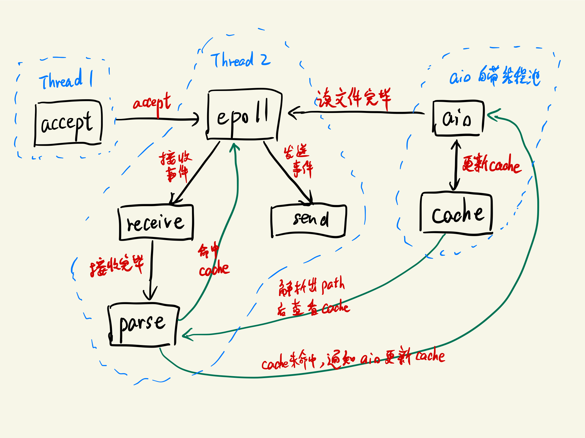

# Lab3 HTTP 服务器

## 编译和运行方法

编译需要链接 `pthread` 和 `aio` 库，并且需要支持 `C++17` 标准的编译器，在确保上述条件满足的情况下执行

```shell
g++ -std=c++17 -lpthread -lrt -o server main.cpp
```

完成编译，执行

```shell
./server
```

开始运行。

## 设计思路与原理

程序的整体结构图如下：

<div align="center">

</div>

使用的重点技术有

- 多线程：用于分离监听线程和收发线程

- `epoll`: 用于监听收发 socket, 采用 IO 多路复用，提高并发能力

- `aio`: 用于高效读取文件，异步 IO 有利于提高多个文件同时读的能力

- 缓存：减小不必要的读文件开销

监听进程（图中的 accept）运行在 `Thread1` 中，每收到一个新连接，就向 `epoll` 注册接收事件。

`epoll` 运行在 `Thread2` 中，负责监听所有接收和发送 socket 的变化，`epoll` 是事件驱动的，每当有可读或可写的事件发生时，都会调用对应的处理函数（如 `receive`, `send_200`, `send_404`, `send_500`）。**所有的 socket 都被设置为 `非阻塞` 模式，同一个 socket 的相同处理函数可能会被多次调用才能完成收发任务，在相应的处理函数中做了满足要求的设计。**

接收数据完成（读到 `\r\n\r\n`）之后，调用 `parse` 函数，寻找请求的文件路径（请求格式错误会直接注册 `500` 回复事件，包括非 `GET` 请求、非 `HTTP` 协议等错误）。**本程序中把请求中第一个空格和第二个空间间的字符串作为请求文件路径.**

找到路径后，**先查找 cache 是否已缓存对应的文件**（此处做了优化，**可以识别文件的更改**），若缓存命中，则直接注册回复事件。若未命中，使用 `aio` 注册一个异步读文件的事件。

cache 由 STL 库 `unordered_map` 封装实现，本质是一个 hash 表。

当文件读完之后，`aio` 调用**回调函数**，更新缓存，并注册回复事件。

## 遇到的问题与解决方案

### 1. 过多动态内存分配影响性能，且有内存泄漏风险

**考虑到程序中同一时间 socket 是全局唯一的，本程序采用静态内存分配，以 socket 作为 key 访问需要的数据。** 数据储存结构如下：

```c++
// 静态分配总数
const int PACK_NUM = 20000;

// socket 回复类型
enum Resp_Type {
    RESP_200,
    RESP_404,
    RESP_500
};

// 静态数据分配
struct {
    int socket_fd;
    // receive
    char *req;
    size_t req_len;
    size_t recvd_len;
    size_t max_req_len;
    // parse
    char *path;
    size_t path_len;
    // read
    char *file;
    size_t file_len;
    struct timespec file_mtime;
    int file_fd;
    size_t read_len;
    struct aiocb file_cb;   // 异步 IO
    // send
    Resp_Type type;
    size_t sent_len;
    char *head;
    size_t head_len;
} pack[PACK_NUM];
```

获取数据时只需要使用

```c++
auto &it = pack[socket_fd];
// it 引用的结构体中有任何可能用到的数据
// ...
```

### 2. epoll 不支持监听 regular file

让 `epoll` 专门监听 socket 的收发，而读文件交给 `aio` 完成。需要读文件时注册一个异步读取事件，读取完成时自动调用回调函数，以更新 cache, 并注册发送事件。

### 3. 监测路径逸出

为避免访问非 cwd 及子目录下的文件，对于每个请求的路径，先使用 `realpath` 获得实际路径，再用字符串匹配的方式判断是否发生了逸出。若发生，则直接返回 `500` 错误。

### 4. cache 与实际文件的一致性问题

为避免程序运行途中**发生文件更改导致 cache 与实际文件不一致**，若命中 cache, 还会继续使用 `stat` 系统调用**比较文件的修改时间**，修改时间不一致时，也会更新 cache.

## 性能测试

测试环境：Raspberry Pi 3B+, Raspbain 32bit, gcc 6.3

**树莓派通过网线直连计算机。**

在计算机上运行

```shell
siege -c 200 -r 20 http://192.168.10.2:8000/test[size].txt > /dev/null
```

进行性能测试，结果如下：

> 格式说明：Availability / Trans. Rate / Throughput / Concurrency / Elapsed Time

| Size | My Server | Nginx |
| ----- | ----- | ----- |
| 1K   | `100.00%` / `4040.40 trans/sec` / `3.95 MB/sec` / `191.06` / `0.99 secs` | `100.00%` / `2614.38 trans/sec` / `2.55 MB/sec` / `159.30` / `1.53 secs` |
| 16K  | `100.00%` / `1149.43 trans/sec` / `17.96 MB/sec` / `196.39` / `3.48 secs` | `100.00%` / `980.39 trans/sec` / `15.32 MB/sec` / `197.51` / `4.08 secs` |
| 256K | `100.00%` / `104.28 trans/sec` / `25.36 MB/sec` / `197.35` / `38.36 secs` | `100.00%` / `91.87 trans/sec` / `22.97 MB/sec` / `199.69` / `43.54 secs` |
| 4M   | `100.00%` / `6.98 trans/sec` / `26.38 MB/sec` / `198.56` / `573.21 secs` | `100.00%` / `6.04 trans/sec` / `24.15 MB/sec` / `199.80` / `662.44 secs` |
